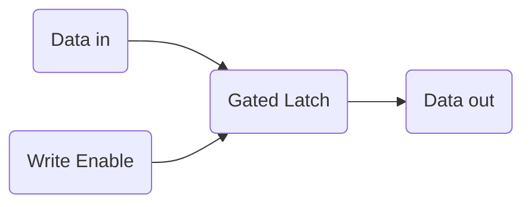
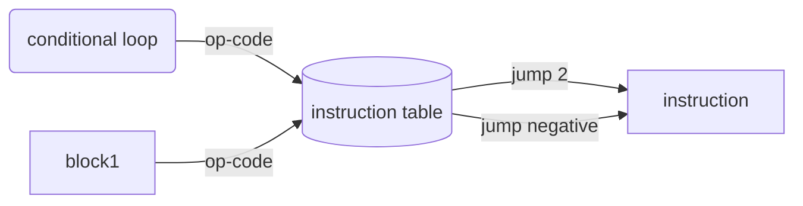

# 计算机组成原理
---

几个出发点:

[知乎网友的答案](https://www.zhihu.com/question/20706264)

[Crash Course CS](https://www.youtube.com/watch?v=tpIctyqH29Q&list=PLH2l6uzC4UEW0s7-KewFLBC1D0l6XRfye)

# Crash Course CS

## 1_Early Computing

From abacus, 

`Charles Babbage`: proposed a "difference engine" by doing polynominal. 

`Hollerith's machine`: the guy in US invent using punch card for computing. He developed this machine and start his business and merge with others unitl nowadays called `IBM`.

## 2_Electronic Computing

`Mechanical relay`: it's not fast cuz mechnical has mass. It also will wear and fail since it's a mechanical gadget. It also attracts bugs like moth. 

> `Grace Hopper`: From now on, when annything went wrong with a computer, we said it had bugs in it. (this is how we get the term bug)

`Triode vacuum tubes`: replacing over mechanical relay. It's expensive tho.

Then vacuum tubes are no longer reliable enough.

`transitor`: it has two electrodes and a gate electrode. It is now 50nm in size in modern dau computer. Since transitor is made of silicon and near california, that place is later on called silicon valley.

## 3_Boolean Logic

> from transistor to logical fate `or`, `not` and `and`. Also, exclusibe or `XOR` has been done by combing basic gates.

It is really important that xxxx have proven mathmatically that all language could be expressed with a series of true and false. Whom?

## 4_binary

### represent number

`base-10 notation` or `decimal notion` is what we are familar with.

比较了10进制和2进制，做了analogy.

### what about letter?
`ASCII`: a 7-bit code.

`MOJIBAKE`: scrabmbled letters. 也就是乱码

`UNICODE`: one code to rule them all. 16 bit (a million codes) to unite every lanaguage, emoji, symbols etc.

## 5_How Computer Calculates_ALU

>`ALU`: Arithmetic logic unit handling all the computation.

Consider XOR gate,

|Input|Input|Output|
|-|-|-|
|A|B|SUM|
|0|0|0|
|0|1|1|
|1|0|1|
|1|1|0|

Since binary can only store 1 bit, the result of 1 + 1 in binary would be 10. Where to store the **carry** bit?

We can use an `And` gate for storing the **carry** bit.

|A|B|Carry|Sum|
|-|-|-|-|
|0|0|0|0|
|1|0|0|1|
|0|1|0|1|
|1|1|1|0|

Then, we could go up another level to `full adder`.

Then, if we combine full adders together, `8-bit Ripple Carry Adder` would do the job. A 8-bit ripple carry adder has 8 sum output and 1 carry. If the calculation goes over the carry bit, it will cause `overflow`.

`overflow`: An overflow occurs when the result of an addition is too large to be represented by the number of bits you are using. This can usually cause erros and unexpected behavior.

This is often encountered in numerical method if your numerical solution diverges.

## 6_Regiseter_and_RAM

`AND-OR latch`: Combine `And` gate with `or` gate.

`Gated latch`: able to stay 1 bit information. 

A group of latches operating like this is called **a register**, which holds a single number, and the number, and the number of bits in a register is called width.

`16 x 16 latch matrix`:  

# 7_CPU

CPU has three phases
- fetch phase
- decode phase
- execute phase

Here is an example of cpu architecture. 

[CPU explanation](https://www.youtube.com/watch?v=FZGugFqdr60&list=PL8dPuuaLjXtNlUrzyH5r6jN9ulIgZBpdo&index=8)

# 8_Instructions & Programs
---
It explains how loop, operation code and instruction connects. 

One instruction looks like

## Reference
!(指令集和处理器架构)[https://upload.wikimedia.org/wikipedia/commons/thumb/2/2a/Mips32_addi.svg/2880px-Mips32_addi.svg.png]

# 9_Advanced CPU designs

The famous `INTEL 4004 instruction set`

