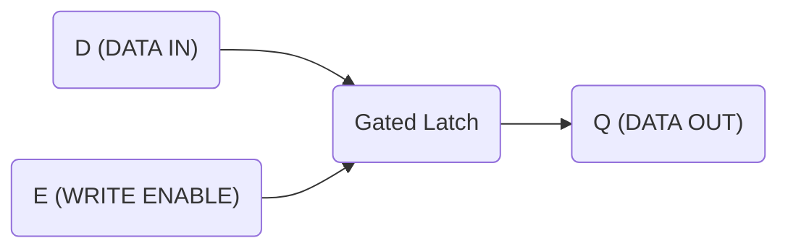
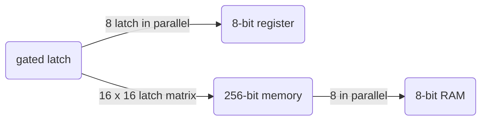
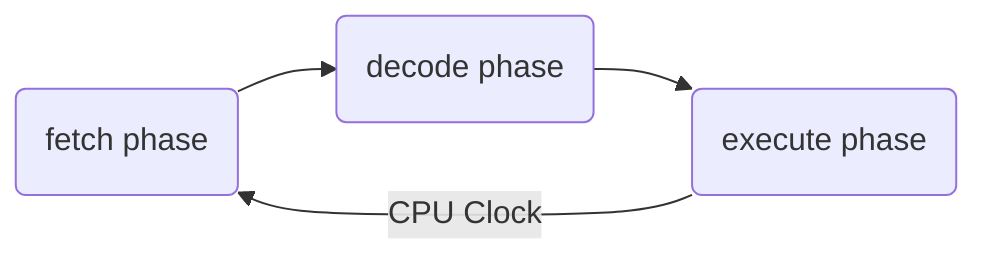
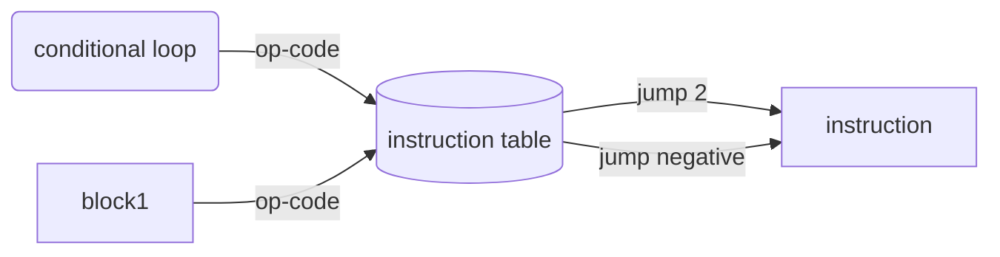

# 计算机组成原理
---
As an self-taught data scientist and programmer, you might be stuck or confused at certain problems and concepts but you move along. Sometime you are less intuitive in some problem-solving when you are facing computer science problem. It is because we haven't been trained to do so and we did not take all the courses offered in computer science degree.  

Some inspiring works:

- [知乎网友的答案](https://www.zhihu.com/question/20706264)
- [小林coding](https://github.com/xiaolincoder/CS-Base)
  - Really good graphical explanation of computer system, protpcal and MySQL etc.
- [Crash Course CS](https://www.youtube.com/watch?v=tpIctyqH29Q&list=PLH2l6uzC4UEW0s7-KewFLBC1D0l6XRfye)
  - literally the **youtube bible** for understanding how computer works. You will start to understand how computer works and why it develops to what we have now.


This is some command for you to get the cache line 1 size in your terminal.
```bash
# on mac
# get genereal info
system_profiler SPHardwareDataType;
# get the L1 cache size
sysctl -a | grep hw.l1
```

# Crash Course CS

## 1_Early Computing

From abacus, 

`Charles Babbage`: proposed a "difference engine" by doing polynominal. 


`Hollerith's machine`: the guy in US invent using punch card for computing. He developed this machine and start his business and merge with others unitl nowadays called `IBM`.

## 2_Electronic Computing

`Mechanical relay`: it's not fast cuz mechnical has mass. It also will wear and fail since it's a mechanical gadget. It also attracts bugs like moth. 

> `Grace Hopper`: From now on, when annything went wrong with a computer, we said it had bugs in it. (this is how we get the term bug)

`Triode vacuum tubes`: replacing over mechanical relay. It's expensive tho.

Then vacuum tubes are no longer reliable enough.

`transitor`: it has two electrodes and a gate electrode. It is now 50nm in size in modern dau computer. Since transitor is made of silicon and near california, that place is later on called silicon valley.

## 3_Boolean Logic

> from transistor to logical fate `or`, `not` and `and`. Also, exclusibe or `XOR` has been done by combing basic gates.


It is really important that xxxx have proven mathmatically that all language could be expressed with a series of true and false. Whom?

## 4_binary

### represent number

`base-10 notation` or `decimal notion` is what we are familar with.

比较了10进制和2进制，做了analogy.


### what about letter?
`ASCII`: a 7-bit code.

`MOJIBAKE`: scrabmbled letters. 也就是乱码

`UNICODE`: one code to rule them all. 16 bit (a million codes) to unite every lanaguage, emoji, symbols etc.


## 5_How Computer Calculates_ALU

>`ALU`: Arithmetic logic unit handling all the computation.

Consider XOR gate,


|Input|Input|Output|
|-|-|-|
|A|B|SUM|
|0|0|0|
|0|1|1|
|1|0|1|
|1|1|0|

Since binary can only store 1 bit, the result of 1 + 1 in binary would be 10. Where to store the **carry** bit?


We can use an `And` gate for storing the **carry** bit.

|A|B|Carry|Sum|
|-|-|-|-|
|0|0|0|0|
|1|0|0|1|
|0|1|0|1|
|1|1|1|0|

Then, we could go up another level to `full adder`.


Then, if we combine full adders together, `8-bit Ripple Carry Adder` would do the job. A 8-bit ripple carry adder has 8 sum output and 1 carry. If the calculation goes over the carry bit, it will cause `overflow`.


`overflow`: An overflow occurs when the result of an addition is too large to be represented by the number of bits you are using. This can usually cause erros and unexpected behavior.

This is often encountered in numerical method if your numerical solution diverges.

## 6_Register_and_RAM
---

### How to store one bit information

`AND-OR latch`: Combine `And` gate with `or` gate.

But the good-old `AND-OR` latch may not be that useful, so we bump up to `gated latch`. It is defined as,
`Gated latch`: You can consider gated latch could store 1-bit information and it has two inputs and one output.



Storing one-bit information may not be that useful, so we uses a group of latches operating like this is called **a register**, which holds a single number, and the number, and the number of bits in a register is called **width**.


`8-bit register`: putting 8 gated latch side by side, we have a 8-bit resister.


The 8-bit register needs 8 wires for input, 8 for output, 1 for write enable (please ignore CP, MR and read enable for now, i will find or make another diagram), the total number of wires needed are:
$$
\begin{equation}
    N \times 2 + 1
\end{equation}
$$ 
where N is for N-bit register. 

The side-by-side parallel latch architecture is okay for smaller register (8*2 + 1) but when the number of bits stored get larger, it is very inefficient to have so many wires.

> The solution is a matrix!!!!


`16 x 16 latch matrix`: for storing 256 bits of information, we only need 35 wires = 16 for row selection, 16 for column selection, 1 for ReadEnable, 1 fpr WriteEnable, 1 data wire.


But you still need a special `multiplexer` for storing the collumn address and row address. In 16 x 16 latch matrix, for row, the maximum is 16 wires in decimal (15 if counting from zero.) We convert 15 to binary, which is `1111`. That means you only need 4 bit to store information for row address!!! It is called a `multiplexer`.

If we align eight of 256-bits memory together, and we share the address wires for all of 256-bits memory. We could store 8-bits information at 256 different addresses (16 x 16)! Just like the figure below.


In summary, in this episode, **the level of abstraction** works like this,

### More reading
[Diff types of registers](https://www.tutorialandexample.com/registers)

# 7_CPU
---
A little recap on the register, there are three common types of register in modern computer,
- INST. ADDR. Register
- INSTRUCTION REGISTER
- REGISTER


CPU operation has three phases has three following phases


How fast the fetch, decode, execute cycles would be measured in Hz by the CPU Clock.

Here is an example of cpu architecture,


[CPU explanation](https://www.youtube.com/watch?v=FZGugFqdr60&list=PL8dPuuaLjXtNlUrzyH5r6jN9ulIgZBpdo&index=8)

# 8_Instructions & Programs
---
It explains how loop, operation code and instruction connects. 


One instruction looks like


## Reference
!(指令集和处理器架构)[https://upload.wikimedia.org/wikipedia/commons/thumb/2/2a/Mips32_addi.svg/2880px-Mips32_addi.svg.png]


# 9_Advanced CPU designs
---
The famous `INTEL 4004 instruction set`


# 10_Early Programming
---
An interface between computer and human are needed.


# 11_The first programming language
---

`Assembly language`: Assembly languages have **direct, one-to-one mapping to machine instructions (binary)**. But a single line of high-level programming language might result in dozens of instructions being executed by the CPU.

Harvard Mark 1


# 12_Statement and Functions
---

- statement
- control flow statement
  - Assignment statement
  - conditional statement
    - if
    - for
    - while
  - return statement


For a code that is repeatable, you don't really want to copy and paste it everywhere, since it will result in:
- changing variable name
- more lines of codes, higher chance of bugs

Therefore, to compartentalize and hide complexity, programing language packs it into 
- function, method or subroutine

# 13_Algorithm
 ---

Outline:
- selection sort
- merge sort
- graph search

 # 14_Data structure
---

