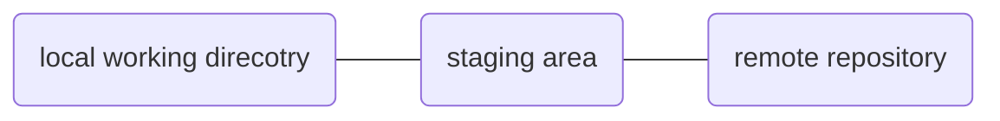
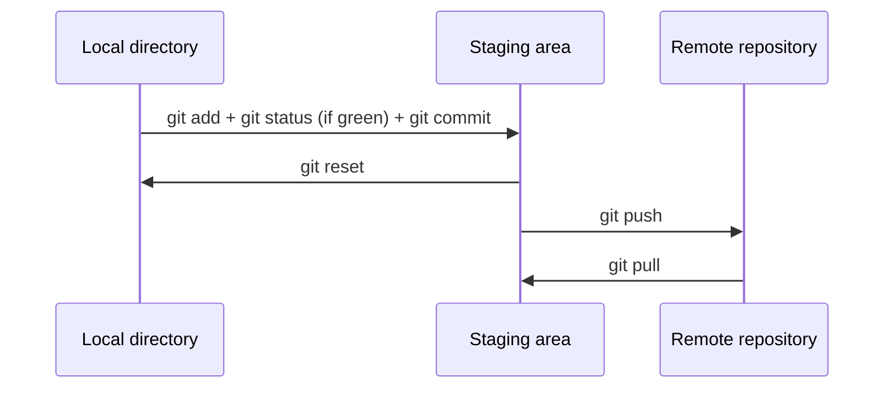

# README
>This is my journey for learning data structure with python. It is inevitable for me to come across this eventually and the course i selecte is the MOOC from Michigan. Please enjoy and stay with me. Happy coding.

# Table of content

- [README](#readme)
- [Table of content](#table-of-content)
- [How to use git](#how-to-use-git)
  - [What is git?](#what-is-git)
  - [git Architecture](#git-architecture)
  - [Reference](#reference)

# How to use git

## What is git?
`git` is a tool for handling version control. It is often confused with `github`. The difference is that `git` is the tool that handles all of this behind the scene while `github` is the user interface on top of it.

## git Architecture

The main git architecture is shown in the diagram below,

- local working direcotry (Only you can see)
- staging area (buffer area)
- remote repository (every1 can see if public)

The default name in local directory is called **master** while the name for remote repository is called **origin**

However, when you are setting up the connection between your local direcotry and remote repository for the first time, you need to initialize with `git push -u origin master` so for the rest of the time, you just need to use `git push`.

## Reference
[git-tech with tim](https://www.youtube.com/watch?v=DVRQoVRzMIY)
[git-Corey schafer](https://www.youtube.com/watch?v=HVsySz-h9r4)
