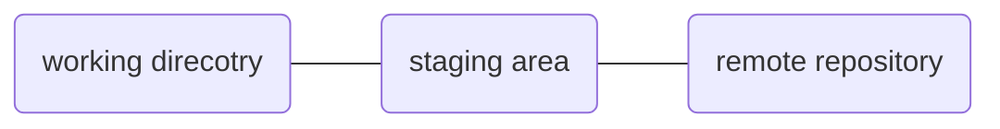

# README
---
This is my journey for learning data structure with python. It is inevitable for me to come across this eventually and the course i selecte is the MOOC from Michigan.

# How to use git
---
There are two ways to use git:
- local machine
- clone it from repository

