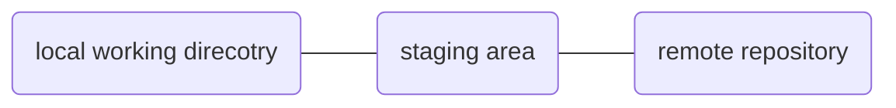

# README
>This is my journey for learning data structure with python. It is inevitable for me to come across this eventually and the course i selecte is the MOOC from Michigan. Please enjoy and stay with me. Happy coding.

# Table of content

- [README](#readme)
- [Table of content](#table-of-content)
- [How to use git](#how-to-use-git)
  - [What is git?](#what-is-git)
  - [git Architecture](#git-architecture)

# How to use git

## What is git?
`git` is a tool for handling all version control. It is often confused with `github`. The main difference is that `git` is the tool that handles all of this behind the scene while `github` is the user interface on top of it.

## git Architecture

The main git architecture is shown in the diagram below. 

