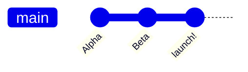
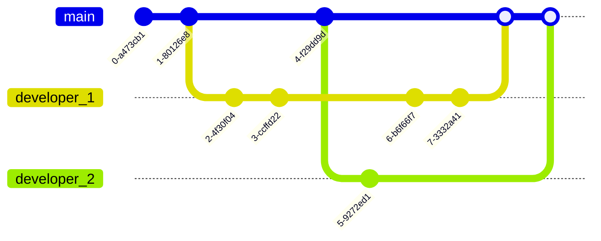
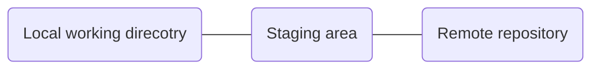
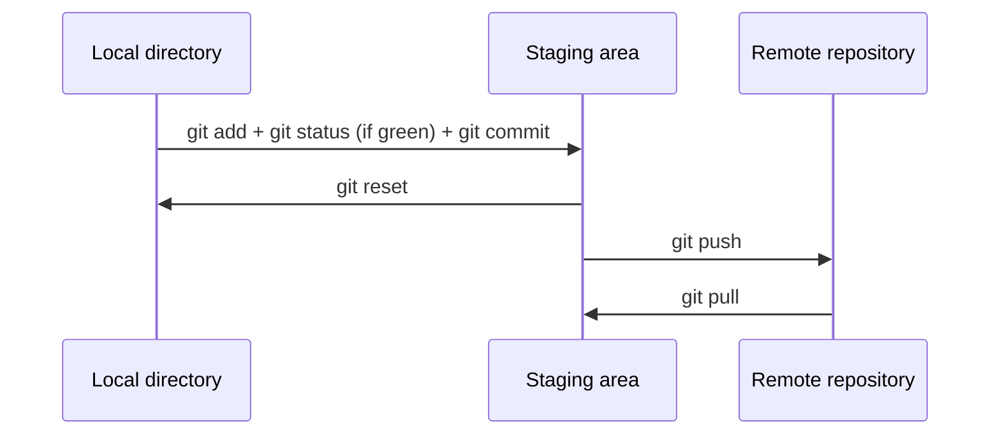

# Git guide
---
As a self-taught data scientist, one of the very first concept that you are going to encounter is `git` and you have probably heard of `github` now.  

# Table of content
- [Table of content](#table-of-content)
  - [What is git?](#what-is-git)
  - [Git Architecture](#git-architecture)
  - [Some basic command](#some-basic-command)
  - [What is branch?](#what-is-branch)
  - [Reference](#reference)


## What is git?
`git` is a version control software. It is often confused with `github`. The difference is that `git` is the tool that handles all of god-sent magic moves behind the scene while `github` is the user interface and serves as a cloud drive for storing called`remote repository`.

From the graph below, you will easily see what have you done so far for the project and it provide you an option to roll back to previous version if you don't like the new feature.

Huh, rollback option is probably not good enough for you to learn all this yet. Let's say you have multiple software developer working on the same project, how would you manage different versions and avoid the trouble that you have to ask your colleagues for new code every single morning in case you will not work on the old code? It can be all handled by `git` with its `branch` and `merge` features which would be covered in the later section. You could have a look at the figure below to have a taste and a deep appreciation for how powerful git is for developers.




## Git Architecture

After you have a basic idea about what is `git` and why we are using it, let's see some diagram to see how it works.

The main git architecture is shown in the diagram below and it is a 2-step method consisting of `add` and `commit`. 


- local working direcotry (Only you can see and it's on your PC)
- staging area (Buffer area where you hold new items)
- remote repository (Everyone can see stored in remote repository)

In step 1 `add`, you add some files from you local working directory in the staging area and those files are ready for step 2.

In step 2 `commit`, you commit the newly added files in staging area from step 1 to the remote repository.

There is a reason why it's a two-step methods instead of 1-step method. Since  

> Note: The default name for local directory is called `master` while the name for remote repository is often called `origin`



However, when you are setting up the connection between your local direcotry and remote repository for the first time, you need to initialize with `git push -u origin master` so for the rest of the time, you just need to use `git push`.

## Some basic command
- `git clone`: get a copy of that repository on our local machine
- `git status`: what's going on in my repository
- `git push`: push my files from local machine to remote repository held by `github`
- `git log`: show a history of log
- `git reset`: going back
  - `--hard` 
  - `--soft`


`Merge conflicts` is a problem might happen when two developer are trying to edit the same file. It is usually done manually, example snippet is shown below

```python
<<<<<<< HEAD
test_msg = "commit!+1"
=======
test_msg = "commit!-1"
>>>>>>> 41093e175ace0787d5b8ce8135e7152521d1e3e0
```


## What is branch?
> branch: add feature and fixing bug separately

> `HEAD` in git means where you at.

- `git branch`
  - `git branch -D branchname`: hard delete the branch
- `git merge`
- `git checkout`: Switch to a different branch 
  - `git checkout -b feature` create a branch


## Reference

From what i have been watching so far, the CS 50 by Harvard gives the best and clearest explanation condensed in 47 mins ish.
 
- [x] git-Harvard CS 50 by Brian https://www.youtube.com/watch?v=eulnSXkhE7I&t=53s
- [x] git-tech with tim https://www.youtube.com/watch?v=DVRQoVRzMIY
- [git by Corey schafer](https://www.youtube.com/watch?v=HVsySz-h9r4)
- [git by David Mahler](https://www.youtube.com/watch?v=uR6G2v_WsRA&t=10s)
  - many visuals

